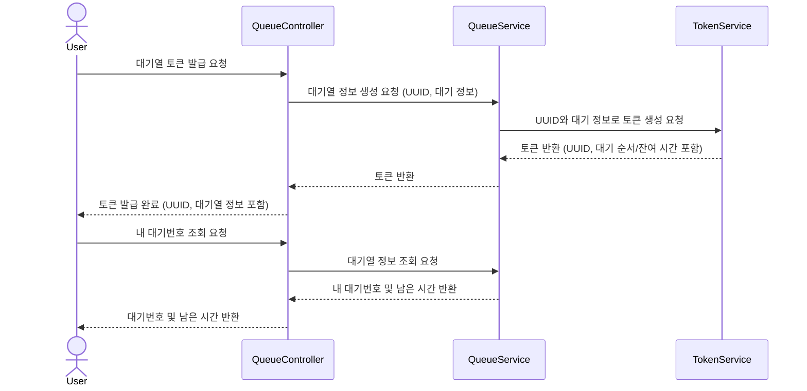
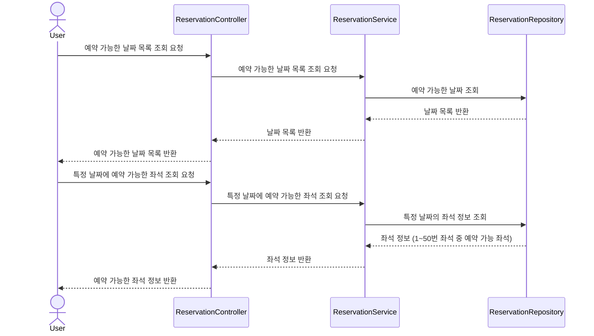
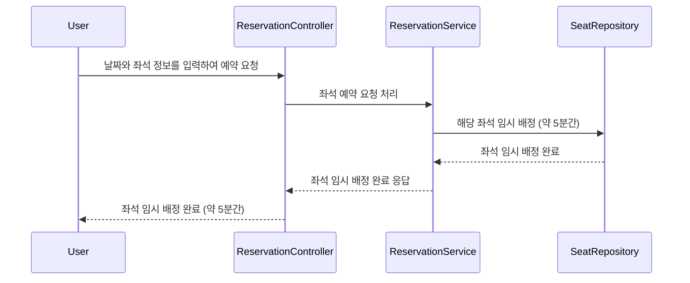
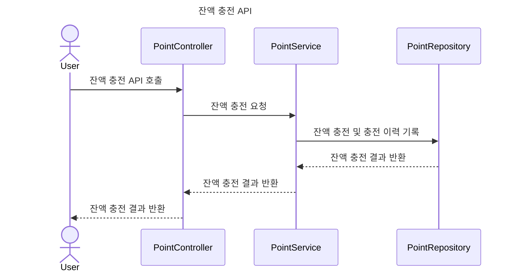
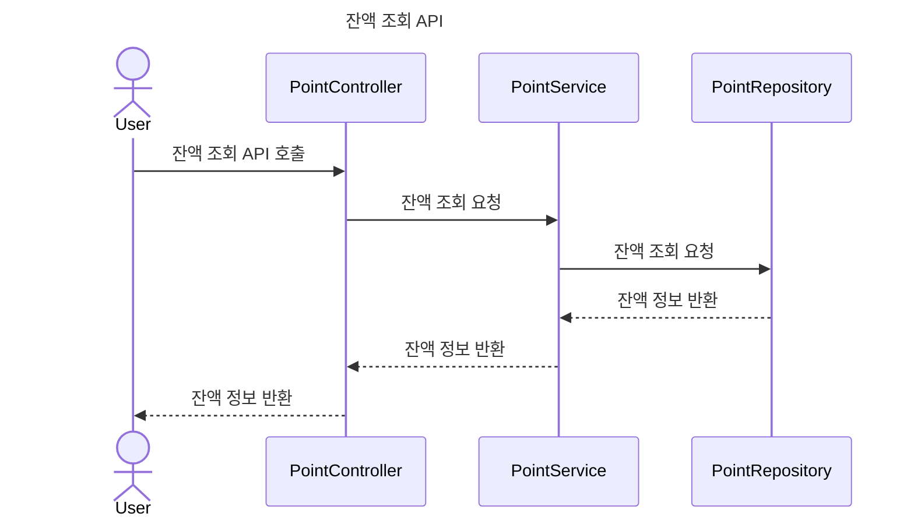
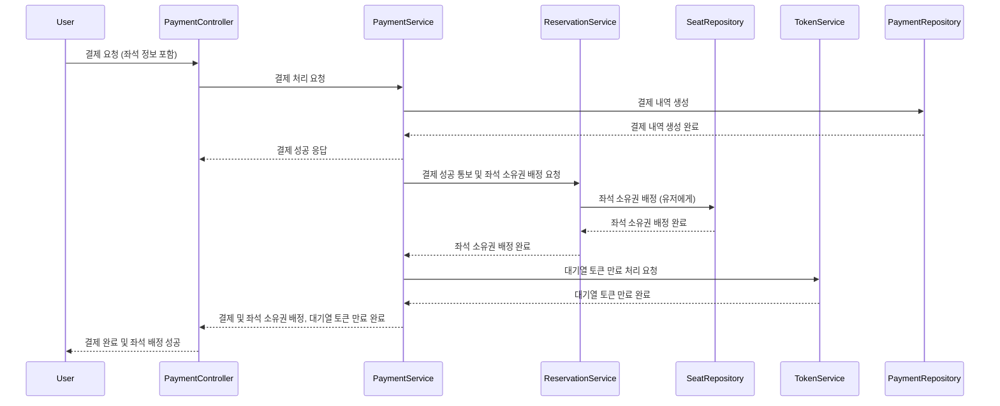

## 1. 유저 대기열 토큰 기능

```mermaid
sequenceDiagram
actor User
participant QueueController
participant QueueService
participant TokenService

    %% 토큰 발급 API
    User ->> QueueController: 대기열 토큰 발급 요청
    QueueController ->> QueueService: 대기열 정보 생성 요청 (UUID, 대기 정보)
    QueueService ->> TokenService: UUID와 대기 정보로 토큰 생성 요청
    TokenService -->> QueueService: 토큰 반환 (UUID, 대기 순서/잔여 시간 포함)
    QueueService -->> QueueController: 토큰 반환
    QueueController -->> User: 토큰 발급 완료 (UUID, 대기열 정보 포함)

    %% 대기번호 조회 API
    User ->> QueueController: 내 대기번호 조회 요청
    QueueController ->> QueueService: 대기열 정보 조회 요청
    QueueService -->> QueueController: 내 대기번호 및 남은 시간 반환
    QueueController -->> User: 대기번호 및 남은 시간 반환
```

## 2. 예약 가능 날짜/좌석 API

```mermaid
sequenceDiagram
actor User
participant ReservationController
participant ReservationService
participant ReservationRepository

    User ->> ReservationController: 예약 가능한 날짜 목록 조회 요청
    ReservationController ->> ReservationService: 예약 가능한 날짜 목록 조회 요청
    ReservationService ->> ReservationRepository: 예약 가능한 날짜 조회
    ReservationRepository -->> ReservationService: 날짜 목록 반환
    ReservationService -->> ReservationController: 날짜 목록 반환
    ReservationController -->> User: 예약 가능한 날짜 목록 반환

    User ->> ReservationController: 특정 날짜에 예약 가능한 좌석 조회 요청
    ReservationController ->> ReservationService: 특정 날짜에 예약 가능한 좌석 조회 요청
    ReservationService ->> ReservationRepository: 특정 날짜의 좌석 정보 조회
    ReservationRepository -->> ReservationService: 좌석 정보 (1~50번 좌석 중 예약 가능 좌석)
    ReservationService -->> ReservationController: 좌석 정보 반환
    ReservationController -->> User: 예약 가능한 좌석 정보 반환
```

## 3. 좌석 예약 요청 API

```mermaid
sequenceDiagram
participant User
participant ReservationController
participant ReservationService
participant SeatRepository

    User ->> ReservationController: 날짜와 좌석 정보를 입력하여 예약 요청
    ReservationController ->> ReservationService: 좌석 예약 요청 처리
    ReservationService ->> SeatRepository: 해당 좌석 임시 배정 (약 5분간)
    SeatRepository -->> ReservationService: 좌석 임시 배정 완료
    ReservationService -->> ReservationController: 좌석 임시 배정 완료 응답
    ReservationController -->> User: 좌석 임시 배정 완료 (약 5분간)
```

## 4-1. 잔액 충전 API

```mermaid
sequenceDiagram
actor User
participant PointController
participant PointService
participant PointRepository
title 잔액 충전 API

    User ->> PointController: 잔액 충전 API 호출
    PointController ->> PointService: 잔액 충전 요청
    PointService ->> PointRepository: 잔액 충전 및 충전 이력 기록
    PointRepository -->> PointService: 잔액 충전 결과 반환
    PointService -->> PointController: 잔액 충전 결과 반환
    PointController -->> User: 잔액 충전 결과 반환
```

## 4-2. 잔액 조회 API

```mermaid
sequenceDiagram
actor User
participant PointController
participant PointService
participant PointRepository
title 잔액 조회 API

    User ->> PointController: 잔액 조회 API 호출
    PointController ->> PointService: 잔액 조회 요청
    PointService ->> PointRepository: 잔액 조회 요청
    PointRepository -->> PointService: 잔액 정보 반환
    PointService -->> PointController: 잔액 정보 반환
    PointController -->> User: 잔액 정보 반환
```

## 5. 결제 API

```mermaid
sequenceDiagram
    participant User
    participant PaymentController
    participant PaymentService
    participant ReservationService
    participant SeatRepository
    participant TokenService
    participant PaymentRepository

    %% 결제 처리 요청
    User ->> PaymentController: 결제 요청 (좌석 정보 포함)
    PaymentController ->> PaymentService: 결제 처리 요청
    PaymentService ->> PaymentRepository: 결제 내역 생성
    PaymentRepository -->> PaymentService: 결제 내역 생성 완료
    PaymentService -->> PaymentController: 결제 성공 응답

    %% 좌석 소유권 배정
    PaymentService ->> ReservationService: 결제 성공 통보 및 좌석 소유권 배정 요청
    ReservationService ->> SeatRepository: 좌석 소유권 배정 (유저에게)
    SeatRepository -->> ReservationService: 좌석 소유권 배정 완료
    ReservationService -->> PaymentService: 좌석 소유권 배정 완료

    %% 대기열 토큰 만료 처리
    PaymentService ->> TokenService: 대기열 토큰 만료 처리 요청
    TokenService -->> PaymentService: 대기열 토큰 만료 완료
    PaymentService -->> PaymentController: 결제 및 좌석 소유권 배정, 대기열 토큰 만료 완료
    PaymentController -->> User: 결제 완료 및 좌석 배정 성공
```